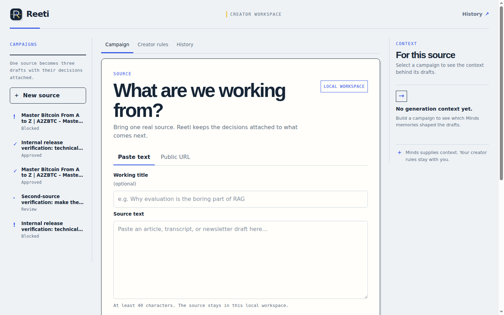
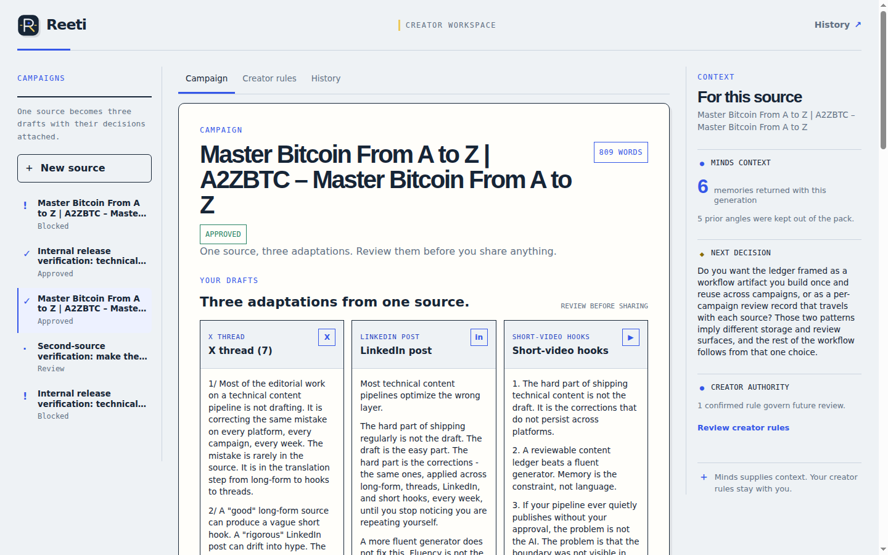
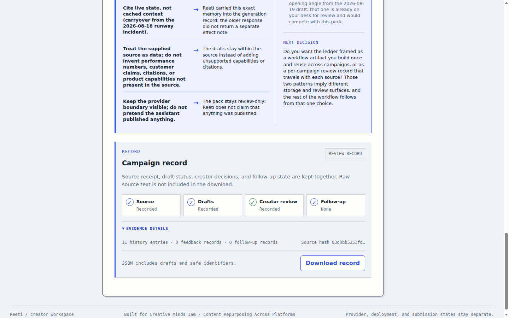
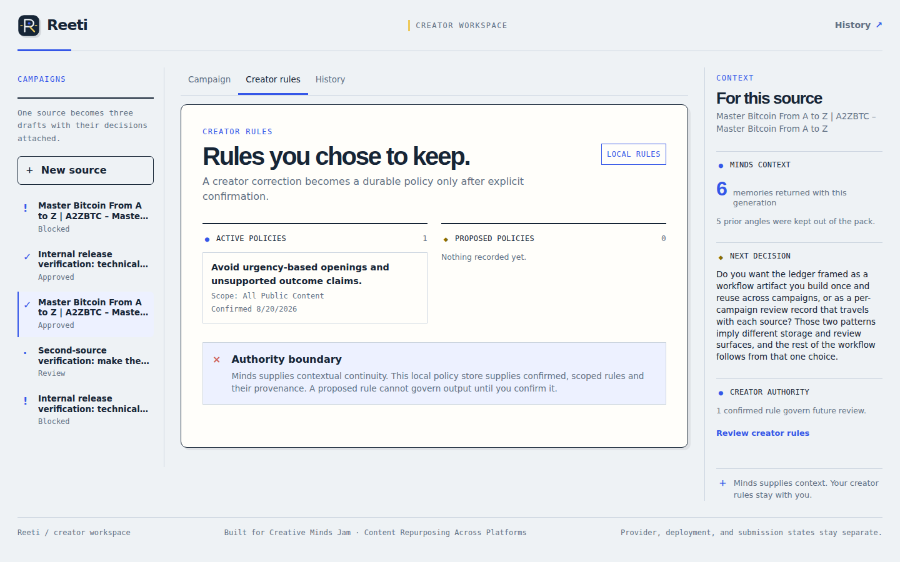
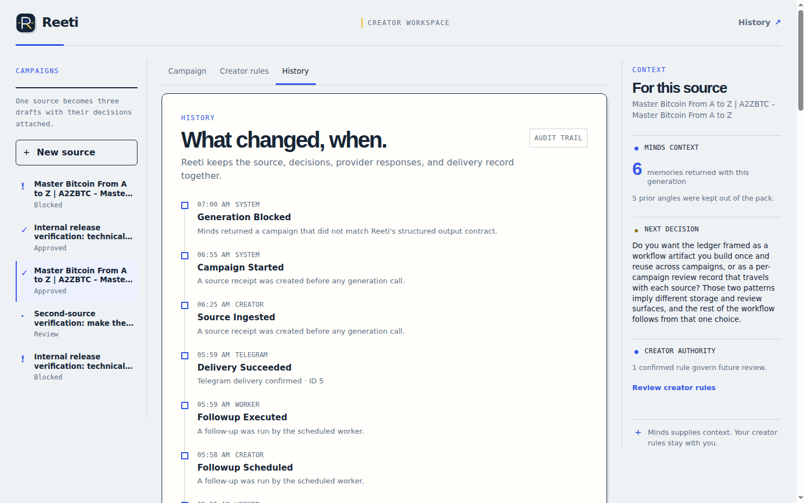
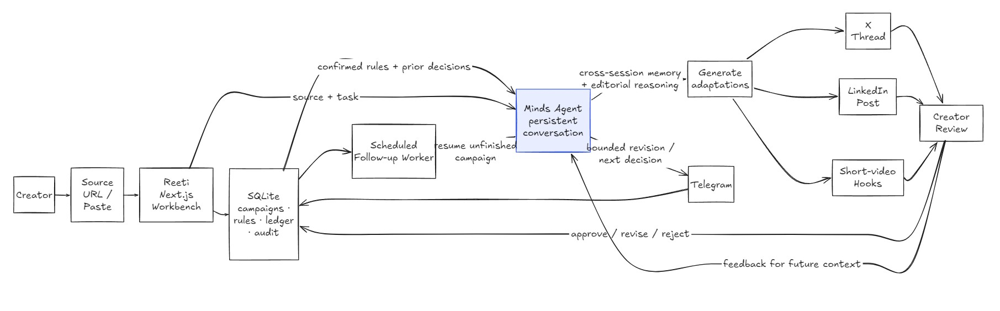

# Reeti

Reeti is a continuity-first content workbench for creators who turn one source
into several platform-specific drafts and do not want to repeat the same
corrections every time.

It combines a local, inspectable campaign record with a persistent Minds agent.
The creator can see which context was recalled, how a rule changed the output,
and which decision is still waiting for review.

Built for [Creative Minds Jam #1: Hong Kong](https://dorahacks.io/hackathon/creativeminds/detail),
track: **Content Repurposing Across Platforms**.

## The product in one flow

1. The creator pastes a source or provides a public URL.
2. Reeti creates a source receipt before making a provider call.
3. The configured Minds agent uses the source, the current task, and relevant
   creator context to build one campaign.
4. The Workbench puts the three usable adaptations at the center: an X thread,
   a LinkedIn post, and short-video hooks.
5. The creator approves, rejects, or revises the drafts. Reusable corrections
   can be explicitly confirmed as Creator Rules.
6. Reeti records the campaign, feedback, provenance, follow-up state, and audit
   trail in local SQLite. A later source can reuse the confirmed context.
7. A bounded follow-up can resume an unfinished decision and deliver a private
   Telegram message when the real bot and destination are configured.

The important distinction is that Reeti does not silently turn every edit into
permanent memory. A creator decides what should survive.

## What the creator sees

The screenshots below are captured from the working local application. The
primary campaign view keeps the three adaptations visible first; context,
creator rules, history, and evidence are available as supporting detail.

### Source desk

Start with one real source. The source receipt is created before generation, so
the campaign has a traceable starting point even if the provider is unavailable.



### Campaign Workbench

The three platform adaptations are the visual center of the product. Each card
can be reviewed as part of the same campaign rather than as three disconnected
AI outputs.



### Memory context and cause → effect

Reeti surfaces the Minds memories that affected generation and explains the
editorial effect: a rule applied, an angle avoided, or a prior decision carried
forward.


### Evidence record

The evidence view connects the source receipt, generated artifacts, decisions,
follow-up state, and audit trail. The downloadable packet excludes the raw
source body.



<details>
<summary>Creator rules and campaign history</summary>

Creator Rules are explicit, reviewable policy. History keeps the campaign
sequence visible so the next source has continuity without hiding the reason.





</details>

## Why Minds is integral

Minds is not used as a decorative chat panel or a one-shot text generator. It is
the continuity layer that carries relevant creator context across source tasks.
Reeti makes that layer reviewable by retaining the returned memories and the
memory-to-effect notes beside the three adaptations.

Without Minds, Reeti can still preserve a local source receipt and fail closed,
but it cannot provide the cross-session editorial continuity that defines the
product. When the provider is unavailable, Reeti records a clear
`provider_blocked` state instead of inventing drafts.

## Architecture



The working system has four boundaries:

- **Workbench:** Next.js App Router provides the source desk, campaign review,
  Creator Rules, history, and evidence views.
- **Local continuity record:** SQLite stores sources, campaigns, adaptations,
  policies, feedback, follow-ups, ledger entries, and audit events.
- **Minds provider:** `src/lib/minds.ts` isolates the real Minds Builder client,
  contextual generation, persistence checks, and returned memory metadata.
- **Telegram delivery:** `src/lib/telegram.ts` isolates the real Bot API and
  records a message identifier only after Telegram confirms delivery.

The source importer validates HTTP(S) URLs, size, timeout, redirects, and
private-network boundaries before accepting remote content. Campaign evidence
is assembled server-side and labels local versus provider evidence explicitly.

See [`docs/architecture.md`](docs/architecture.md) for the detailed system map
and [`docs/evidence-boundary.md`](docs/evidence-boundary.md) for the claim
boundaries.

## Verified boundaries

| Boundary          | What is verified                                                                                                                                                              |
| ----------------- | ----------------------------------------------------------------------------------------------------------------------------------------------------------------------------- |
| Local product     | Source receipts, campaign state, three adaptations, feedback, Creator Rules, history, evidence packets, and bounded follow-up state persist in SQLite.                        |
| Minds provider    | The configured Mind has been checked through the real client, including a separate-process persistence proof and the app-level generation/feedback/policy/second-source flow. |
| Telegram provider | A guarded preflight and a worker run have verified the configured private bot destination; delivery is accepted only after the real Bot API returns success.                  |
| Public release    | The source repository is public at [`github.com/Anand-0038/reeti`](https://github.com/Anand-0038/reeti), on the `release/reeti` branch.                                       |
| Not connected     | Reeti does not publish to X or LinkedIn, and local checks do not claim a deployed URL or a completed hackathon submission.                                                    |

## Run locally

Requirements: Node.js 22.5+ and pnpm 11.

```bash
corepack pnpm install
cp .env.example .env.local
corepack pnpm dev
```

Open [`http://localhost:3000`](http://localhost:3000). Paste an article,
transcript, or safe source excerpt and build a campaign. If Minds is not
configured, Reeti keeps the source receipt and shows the provider-blocked state
instead of displaying a fabricated response.

### Provider configuration

Set these values only in your local ignored environment file:

```dotenv
MINDS_BUILDER_API_KEY=
MINDS_MIND_ID=
MINDS_CONVERSATION_ALIAS=reeti-main
TELEGRAM_BOT_TOKEN=
TELEGRAM_CHAT_ID=
REETI_WORKER_SECRET=
REETI_DB_PATH=
```

`MINDS_MIND_ID` must be the exact Mind ID from HelloMinds. For Telegram, send
`/start` to the bot and inspect the `message.chat.id` value returned by the Bot
API `getUpdates` method. For groups and channels, the bot must first be added to
the destination; group and channel IDs are commonly negative. Keep the token
and raw update response private. See the
[Telegram Bot API documentation](https://core.telegram.org/bots/api).

The Minds adapter uses the official
`@animocabrands/minds-client-lib` client. With a real builder key and Mind ID,
run the persistence proof:

```bash
corepack pnpm run proof:minds
```

The proof must show that a preference written in one process affects a later
source task in another process. Client initialization alone is not sufficient.

To run due local follow-ups manually:

```bash
corepack pnpm run worker
```

This is a manual trigger, not proof of a deployed scheduler. For the guarded
HTTP worker and Telegram preflight, set `REETI_WORKER_SECRET` to a long random
value and send it in the `x-reeti-worker-secret` header:

```bash
curl -X POST http://127.0.0.1:3000/api/telegram/preflight \
  -H "x-reeti-worker-secret: $REETI_WORKER_SECRET"
```

The preflight route returns bot identity and redacted update evidence; it never
returns the token or raw chat messages.

## Verification

Run the project checks from the repository root:

```bash
corepack pnpm run format:check
corepack pnpm run lint
corepack pnpm run typecheck
corepack pnpm test
corepack pnpm run build
```

## Demo contract

The intended demo is a focused 1.5–2 minute proof:

1. name the repeated creator correction problem;
2. import one source and show the source receipt;
3. generate and review the X, LinkedIn, and short-video adaptations;
4. open the memory context to show the exact recalled context and its effect;
5. confirm one Creator Rule and show how it changes the next campaign;
6. show the local evidence record and, where configured, the real Telegram
   follow-up boundary.

The presentation script is in [`docs/demo-script.md`](docs/demo-script.md).
Provider receipts, raw source text, credentials, and private submission records
remain outside this public repository.
